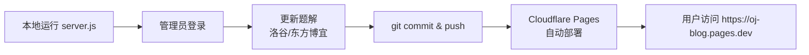

# OJ 题解站 — 项目开发文档

> 章老师的 OJ 题解站 — 信奥赛教练的题解合集  
> 技术栈：纯前端静态站点 + Node.js 本地开发服务器  
> 部署：Cloudflare Pages（GitHub 自动部署）

---

## 一、项目概述

### 1.1 功能

- 展示洛谷（Luogu）和东方博宜（Dfboy）的 OJ 题解
- 按题号、题名、标签搜索筛选
- 标签分类浏览
- 亮/暗主题切换
- 本地开发模式下：密码登录、更新题解（爬虫 + 重建索引）

### 1.2 架构

```
┌────────────────────────────────────────────────────┐
│                   用户浏览器                         │
│  index.html → js/app.js → 渲染题解列表/详情          │
└──────────────┬─────────────────────────┬───────────┘
               │                         │
    Cloudflare Pages               本地开发
    (自动部署自 GitHub)          node server.js
    ┌──────────────┐          ┌──────────────────┐
    │  静态文件直出   │          │  Express 后端服务    │
    │  无需后端服务   │          │  - 登录认证          │
    │  纯前端 SPA    │          │  - 更新题解爬虫      │
    └──────────────┘          │  - 题解数据 API      │
                               └──────────────────┘
```

### 1.3 工作流程



---

## 二、项目结构

```
oj-blog/
├── index.html              # 入口 HTML（加载 CSS/JS）
├── js/
│   └── app.js              # 前端主逻辑（SPA 路由、渲染、交互）
├── css/
│   └── style.css           # 暗色科技风样式
├── fonts/                  # JetBrains Mono 等宽字体
│   └── JetBrainsMono-*.ttf
├── data/
│   └── index.json          # 题解索引（由 build.js 生成）
├── solutions/              # 题解 Markdown 文件
├── server.js               # 本地开发后端（Express）
├── build.js                # 重建索引脚本
├── luogu_fetch.js          # 洛谷爬虫
├── dfboy_fetch.js          # 东方博宜爬虫（题目描述）
├── fetch_dfboy_codes.js    # 东方博宜爬虫（AC 代码）
├── package.json            # Node.js 依赖
├── .env.example            # 环境变量示例
└── DEVDOC.md               # ✨ 本开发文档
```

---

## 三、技术栈

| 技术 | 用途 | 版本 |
|------|------|------|
| HTML5 | 页面骨架 | — |
| CSS3 | 暗色科技风样式、动画 | — |
| Vanilla JS (ES6+) | 前端 SPA 路由、逻辑 | — |
| Node.js | 爬虫、构建、本地服务器 | ≥ 18 |
| Express | 本地开发后端 | 4.x |
| Cloudflare Pages | 生产环境托管 | — |
| GitHub | 源码管理 + 自动部署 | — |

---

## 四、本地开发

### 4.1 环境要求

- Node.js ≥ 18
- npm

### 4.2 安装

```bash
cd blog
npm install
```

### 4.3 配置

复制 `.env.example` 为 `.env` 并修改：

```bash
cp .env.example .env
```

必须配置的项：

```
PORT=8766                                    # 服务端口
USER_PASSWORD=oi2026                         # 普通用户密码
ADMIN_PASSWORD=你的管理员密码                   # 管理员密码
CORS_ORIGINS=http://localhost:8765,http://localhost:8766
```

### 4.4 启动

```bash
# 方式一：直接启动
node server.js

# 方式二：通过 npm
npm start

# 方式三：开发模式（后台运行）
npm run dev
```

访问 `http://localhost:8766` 即可看到登录页面。

### 4.5 双权限账号

| 账号密码 | 角色 | 权限 |
|---------|------|------|
| `oi2026` | 普通用户 | 查看题解、搜索、标签 |
| `.env` 中 `ADMIN_PASSWORD` 的值 | 管理员 | 以上全部 + 更新题解 |

---

## 五、更新题解流程

### 5.1 本地更新

1. 启动本地服务：`node server.js`
2. 浏览器访问 `http://localhost:8766`
3. 使用管理员密码登录
4. 点击导航栏「更新题解」
5. 根据需要选择更新源：
   - **洛谷**：需要提供 Cookie（在洛谷网站登录后从浏览器开发者工具中获取）
   - **东方博宜**：需要提供账号和密码
   - **重建索引**：不需要凭证，仅重新生成 `data/index.json`
   - **全部更新**：同时执行以上所有操作
6. 等待爬虫运行完成

### 5.2 部署到生产

更新完成后，提交并推送代码：

```bash
git add -A
git commit -m "自动更新题解 $(date '+%Y-%m-%d')"
git push origin master
```

Cloudflare Pages 检测到 GitHub 更新后会自动重新部署，约 1-2 分钟后生效。

---

## 六、部署（Cloudflare Pages）

### 6.1 首次部署

1. 登录 [Cloudflare Dashboard](https://dash.cloudflare.com)
2. 进入 **Workers & Pages** → **Create application** → **Pages** → **Connect to Git**
3. 授权 GitHub 并选择 `oj-blog` 仓库
4. 构建配置：

| 配置项 | 值 |
|--------|------|
| Project name | `oj-blog` |
| Production branch | `master` |
| Build command | （留空） |
| Build output directory | （留空） |

5. 点击 **Save and Deploy**

### 6.2 自动部署

每次推送到 `master` 分支，Cloudflare Pages 会自动部署。无需任何额外操作。

### 6.3 绑定自定义域名（可选）

在 Cloudflare Pages 项目 → **Settings** → **Custom domains** 中添加你的域名。

---

## 七、爬虫脚本说明

### 洛谷爬虫 (`luogu_fetch.js`)

- 从洛谷公开 API 抓取题解列表
- 支持 `--force` 参数强制重新抓取所有题目
- 需要 Cookie（登录态）

### 东方博宜爬虫 (`dfboy_fetch.js`)

- 抓取东方博宜题目描述
- 支持 `--force` 参数
- 需要账号和密码

### 东方博宜代码爬虫 (`fetch_dfboy_codes.js`)

- 抓取东方博宜 AC 代码
- 需要账号和密码

### 索引构建 (`build.js`)

- 扫描 `solutions/` 目录生成 `data/index.json`
- 由爬虫完成后自动调用，也可单独运行：`npm run build`

---

## 八、前端架构

### 8.1 页面路由

基于 URL hash 的单页应用（SPA）路由：

| Hash | 页面 | 说明 |
|------|------|------|
| `#/` | 首页 | 题解列表、搜索 |
| `#/tags` | 标签分类 | 按标签筛选 |
| `#/post/:id` | 题解详情 | Markdown 渲染 |
| `#/about` | 关于网站 | 站点信息 |
| `#/guide` | 使用指南 | 仅管理员可见 |
| `#/update` | 更新题解 | 仅管理员可见 |

### 8.2 主题系统

- 支持亮色/暗色/跟随系统三种模式
- 存储在 `localStorage` 中持久化
- 通过 CSS 变量实现全局切换

### 8.3 搜索

- 客户端搜索，无需后端
- 支持题号、题名、标签关键词
- `Ctrl/Cmd + K` 快捷键聚焦搜索框

---

## 九、主题定制

### 颜色变量

编辑 `css/style.css` 中的 CSS 变量：

```css
/* 暗色模式 */
[data-theme="dark"] {
  --bg-primary: #0a0a0f;
  --bg-secondary: #12121a;
  --text-primary: #e0e0e0;
  --accent: #6c5ce7;        /* 主色调 */
  --accent-secondary: #a29bfe; /* 辅助色 */
  /* ...更多变量 */
}

/* 亮色模式 */
[data-theme="light"] {
  --bg-primary: #f8f9fa;
  --bg-secondary: #ffffff;
  --text-primary: #1a1a2e;
  --accent: #6c5ce7;
  --accent-secondary: #a29bfe;
}
```

---

## 十、常见问题

### Q: 前端更新后用户看不到变化？

Cloudflare Pages 有缓存，重新部署后需要 **硬刷新**（`Ctrl/Cmd + Shift + R`）清除缓存。

### Q: 本地 `npm start` 报错？

检查 Node.js 版本：`node -v` 应 ≥ 18。  
检查依赖是否安装：`npm install`。

### Q: 爬虫运行失败？

- 洛谷：Cookie 可能过期，重新从洛谷网站获取
- 东方博宜：账号密码是否正确，网站是否可访问
- 网络问题：检查代理/VPN 设置

### Q: 如何修改版本号/缓存？

前端资源引用带 `?v=20260424b` 版本号参数。修改 `index.html` 中的版本号可使浏览器重新加载。

---

## 十一、技术备忘

### 前端特点

- **零依赖**：原生 JavaScript，无任何框架/库
- **Markdown 渲染**：支持代码高亮（highlight.js）、数学公式（MathJax 可选）
- **响应式**：适配 PC 和移动端
- **性能**：预加载、懒加载、CSS contain 优化

### 本地后端特点

- Express 4.x
- bcryptjs 密码哈希
- helmet 安全头
- express-rate-limit 频率限制

---

*最后更新：2026-05-10*  
*由 Senior Developer (高级开发工程师) 维护*
